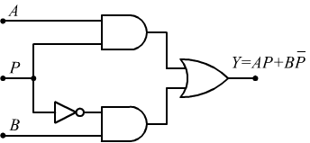
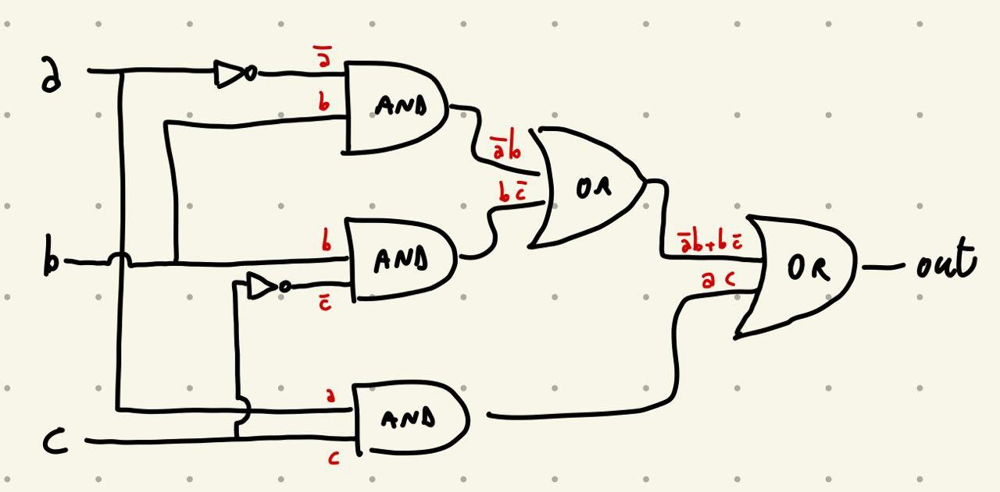
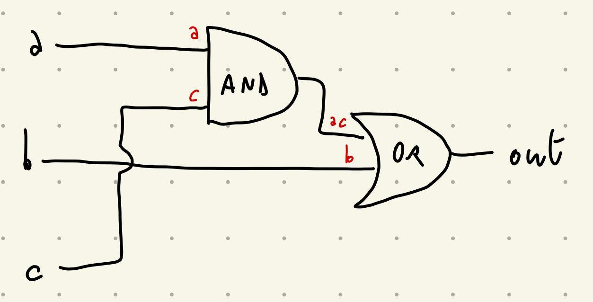

# Esame 09/01/2019

## 1) Cosa si intende con Multiplexer?
Il multiplexer è un cirtuito combinatorio con 3 ingressi e un'uscita. Serve, dati due input, a scegliere quale mandare in output.

Gli ingressi solitamente vengono indicati con `a`, `b` e `sel` e l'uscita con `out`.

- Se `sel == 0` allora restituiamo il valore di `a`
- Se `sel == 1` allora restituiamo il valore di `b`

Può essere costruito a partire dalle porte `NOT` e `AND`, a loro volta costruite da porte `NAND`

---

## 2) Disegnare il circuito corrispondente alla funzione
$$f (a, b, c) = \overline{a}b + b\overline{c} + ac$$
Soluzione naive             | Soluzione minimale
:-:                         | :-:
 | 

---

## 3) Cosa si intende con virtual machine?
Con virtual machine si intende un modello astratto di calcolo, non si fa riferimento ad una specifica architettura

È uno step intermedio tra il linguaggio ad alto livello (per esempio C) e il linguaggio assembler

Esempio: ho un programma scritto in C, lo compilo per la virtual machine, e successivamente compilo da virtual machine ad assembler

Il vantaggio è che non bisogna avere un compilatore per ogni tipo di Hardware, sarà la virtual machine ad occuparsene

---

## 4) Illustrare funzionamento e utilità del pipeline.

Si ha una pipeline quando la CPU esegue contemporaneamente più fasi del ciclo FDE, ad esempio con il chip dedicato IFU (Instruction Fetch Unit) che gli permette di eseguire un pre-fetch sulla successiva istruzioned a seguire. Questo è un esempio di pipeline a due stadi.

Esistono pipeline a molteplici stadi, noi abbiamo citato una con 7 stadi.

Risulta estremamente utile perchè fa guadagnare tempo, non dovendo la CPU a fine esecuzione dell'istruzione precedente leggere l'istruzione successiva. Ciò (ed altri esempi più complessi) però genera altri problemi, come nel caso dei salti. In caso di salto la CPU ha lavorato inutilmente e deve ricominciare dall'istruzione legata al salto.

Oggi esistono metodi avanzati per cercare di predire i salti e ottimizzare.

Un altro problema che può venirsi a verificare è l'accesso concorrente ai registri, questo nel caso di pipeline a molteplici stadi. Per esempio potremmo voler leggere in anticipo un valore in memoria ma dobbiamo prima aspettare che l'istruzione precedente l'abbia sovrascritto (se voluto). Cioè porta via tempo, quindi esistono tecniche complesse che permettono di riordinare le istruzioni per limitare le situazioni di questo tipo.

---

## 5) Si immagini di estendere l'architettura del processore HACK con un registro E, e circuiti per usarlo in modo analogo al registro D. Discutere vantaggi e svantaggi di questa modifica.

Lo svantaggio principale è il costo di produzione, anche perchè i programmi che possono essere effettuati con i soli registri A, D, M sono gli stessi dei programmi che posso essere effettuati con i registri A, D, E, M

Il vantaggio sarebbe per chi scrive il programma, perchè avrebbe un registro in più dove salvare dati. Ad esempio per effettuare `RAM[1] - RAM[2]` e inserirla dentro a `RAM[0]` nel caso di un registro aggiuntivo scriveremo (ammesso possa essere usato in questo modo):

    @1
    D = M
    @2
    E = M
    @0
    M = D - E

Più facile da pensare, ma possibile anche senza E, e in questo caso più corto:

    @2
    D = D - M
    @0
    M = D

---

## 6) Si consideri il numero decimale 102. Lo si converta in binario e in esadecimale e si descriva il metodo usato

    102 = 1 * 2^6 + 38
     38 = 1 * 2^5 + 6 
      6 = 0 * 2^4 + 6 
      6 = 0 * 2^3 + 6 
      6 = 1 * 2^2 + 2
      2 = 1 * 2^1 + 0
      0 = 0 * 2^0

102 = 1100110

    102 = 6 * 16^1 + 6
      6 = 6 * 16^0

102 = 66

In entrambi i casi divido per la base elevata al numero più grande possibile, tenendo traccia di quanto sia il risultato, inoltre tengo da parte il resto, ripeto fino a che non arrivo con l'esponenete = 0
Il numero iniziale in base dieci convertito nella base scelta è la sequenza di 

---

## 7) Si consideri la funzione booleana di sotto. Se ne scriva la tabella di verità e la rappresentazione in forma canonica
$$f(a,b,c,d) = bc(\overline{a+b}) + \overline{\overline{c} \overline{d}} + ab\overline{d}$$

$$a$$ | $$b$$ | $$c$$ | $$d$$ | $$bc(\overline{a+b}) + \overline{\overline{c} \overline{d}} + ab\overline{d}$$
:-: | :-: | :-: | :-: | :-:
0 | 0 | 0 | 0 | 0
0 | 0 | 0 | 1 | 1
0 | 0 | 1 | 0 | 1
0 | 0 | 1 | 1 | 1
0 | 1 | 0 | 0 | 0
0 | 1 | 0 | 1 | 1
0 | 1 | 1 | 0 | 1
0 | 1 | 1 | 1 | 1
1 | 0 | 0 | 0 | 0
1 | 0 | 0 | 1 | 1
1 | 0 | 1 | 0 | 1
1 | 0 | 1 | 1 | 1
1 | 1 | 0 | 0 | 1
1 | 1 | 0 | 1 | 1
1 | 1 | 1 | 0 | 1
1 | 1 | 1 | 1 | 1

La forma canonica è
$$
\overline{a}    \overline{b}    \overline{c}    \overline{d} +
\overline{a}    \overline{b}    \overline{c}    d            +
\overline{a}    \overline{b}    c               \overline{d} +
...                                                          +
a               b               \overline{c}    d            +
a               b               c               \overline{d} +
a               b               c               d
$$

|   |   | A | A |   |   |
|---|---|---|---|---|---|
|   |   |   | B | B |   |
| C |   | 1 | 1 | 1 | 1 |
| C | D | 1 | 1 | 1 | 1 |
|   | D | 1 | 1 | 1 | 1 |
|   |   | 0 | 1 | 0 | 0 |

---

## 8) Si scriva codice assembly HACK corrispondente al codice C seguente, assumento che `i` e `j` siano interi memorizzati rispettivametne in `MEM[0]` e in `MEM[1]`

    C:
    if (i-3==0) {j=j-1;} else {j=j*3;}

    ASSEMBLY HACK:
    @0
    D = M               // D = i-3
    @3
    D = D - A
    @ELSE
    D;JNE               // if i-3 == 0
    @1                  // then
    M = M - 1
    @END
    0;JMP
    (ELSE)              // else
        @2
        D = A
        @k              // *k = 2
        M = D
        @1              // D = MEM[1]
        D = M
        @j              // *j = D
        M = D
        (LOOP)          // while
            @k
            D = M
            @END
            D;JEQ       // *k != 0
            @j          // MEM[1] += *j
            D = M
            @1
            M = M + D
            @k          // *k += 1
            M = M - 1
            @LOOP
            0;JMP
    (END)
        @END
        0;JMP

---

## 9) Si consideri il seguente codice per la VM HACK

    label LOOP
    push constant 6
    push constant 8
    eq
    not
    if-goto LOOP
    push constant 5

Si descriva cosa succede quando questo codice viene eseguito (si assuma che la VM sia stata correttamente inizializzata).

1. Genera un'etichietta, che verrà usata successivamente con il comando goto per ripetere delle istruzioni
2. Mette in cima allo stack il numero 6
3. Mette in cima allo stack il numero 8
4. Verifica che i due numeri in cima allo stack siano uguali, poichè è 6 == 8 è falso vengono cancellate le prime due righe dello stack e viene inserito false
5. Nega il valore in cima allo stack, quindi da false passa a true
6. Verifica che sia vero il valore in cima allo stack, poichè è vero allora ritorna in cima e ripete il ciclo
7. Non viene mai eseguita

In tutto avrò una ripetizione continua delle prime sei righe, mentre poichè non potrò mai uscire dal ciclo